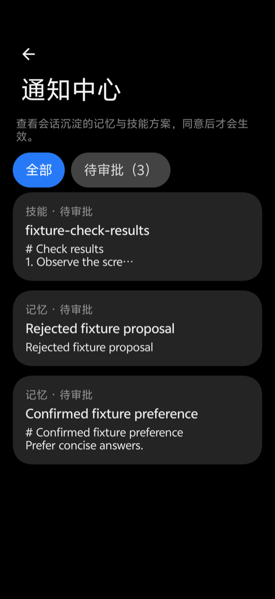
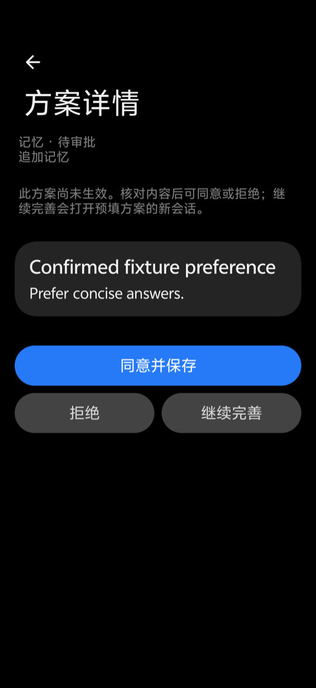
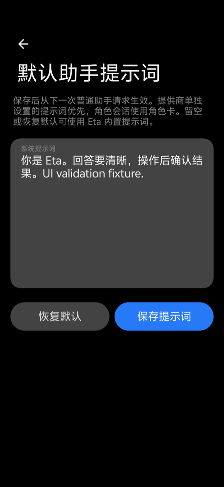
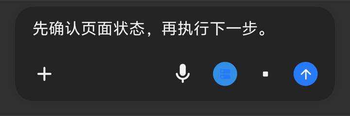
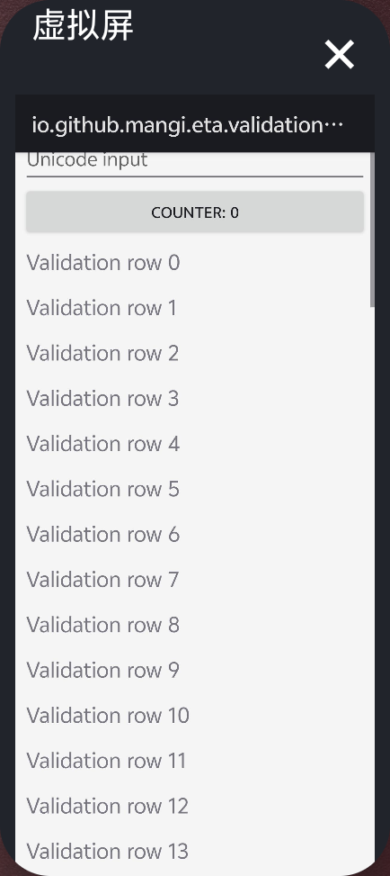

# 3.3.1-beta.1 验证记录

## 环境

- 上游基线：3.3.0，`9de3a3f`；本分支原基线：`07db61f`。
- 构建：JDK 25.0.3、Android SDK 37.0、项目 Gradle Wrapper。
- 手机：vivo V2419A，Android 16，OriginOS `PD2419B_A_16.1.12.38.W10`，KernelSU / LSPosed，无线 ADB。
- 实机使用 Debug APK 和独立测试应用。模型请求使用本机 HTTP/SSE 测试服务；记忆审批使用临时目录和独立 Room 数据库，不调用付费模型，也不改写用户记忆或技能。

## 构建检查

`./gradlew :app:assembleDebug :app:assembleDebugAndroidTest :app:testDebugUnitTest :app:lintDebug` 成功。

| 检查 | 结果 |
| --- | --- |
| JVM 单元测试 | 1768 项，0 失败，0 错误，2 跳过 |
| Android Lint | 0 错误，401 警告 |
| Debug / 测试 APK | 构建成功 |
| Release APK | R8 构建成功，APK v2 签名校验通过 |
| 数据库迁移 | 上游 22、原分支 25、早期贡献分支 25 的模型绑定、时长、错误与自动任务数据保留；通知中心新增表迁移通过 |

两个跳过项分别受 Robolectric 子着色器支持和 macOS 缺少 `/proc` 限制。最后核对上游贡献分支时补回请求耗时、调度并发锁和显式坐标系，并增加对应迁移与边界回归；完整构建、单元测试和 Lint 重新执行。

Release 版本 `3.3.1-beta.1`，版本码 `2026101001`，沿用 Eta-vivo 发布证书。实机功能结果来自 Debug，Release 未覆盖安装到测试手机。
无线调试恢复后，已安装最终兼容版本的 Debug APK，重跑下表全部 7 组实机回归，共 167 项检查通过。

浮窗回归起初发现测试手势未指定 display，系统焦点在虚拟屏时手势跟随焦点路由，主屏预览没有收到拖动。测试现将点击、拖动明确发往主屏，浮窗 33 项检查重新通过。连续重启 instrumentation 时 OriginOS 曾暂未重新绑定无障碍服务，等待服务恢复后，GUI 边界和无树检查重新通过。

## 实机检查

通过以下 instrumentation 模式，各项都核对真实结果：

| 模式 | 检查数 | 覆盖 |
| --- | ---: | --- |
| `stop_resume` | 14 | 停止保留 display，续聊重新观察再操作；失败保留现场 |
| `interjection` | 15 | 真实 Binder / Runtime 中断卡住的 HTTP 请求，插话进入下一请求，半截输出不进历史，无失败重试，错 run / 结束后拒绝 |
| `feature_ui` | 43 | 提示词编辑保存重置，输入框插话与独立停止，延迟拒绝保留新草稿，学习同意一次、拒绝不写、完善传递方案 |
| `floating` | 33 | 主屏预览、真实帧显示、10fps 上限、拖动贴边、折叠停帧、点击查看、查看租约交接、拖离展开、设置与任务结束回收 |
| `gui_audit` | 30 | 连续 6 次操作使用附带的新观察，逐次确认实际计数变化 |
| `gui_edge` | 20 | 仅 checked 状态变化、未点中目标、中文和 emoji 替换/追加 |
| `gui_no_tree` | 12 | Canvas 无有效 UI 树时只执行一次动作，返回一张截图，变化状态为未知 |

本地 SSE 插话测试从接收到结果核验耗时 53ms；这反映测试服务行为，不代表线上模型延迟。GUI 配对测量与限制见 [审计记录](AGENT_GUI_AUDIT_3.3.1.md)。

最终兼容版本的优化后复查仍为 6 次工具调用、6 次已确认动作、0 张附图，工具累计耗时 3526ms。性能对比使用审计记录中的原始同机配对测量。

测试命令示例（指定无线调试设备）：

```bash
adb -s <wireless-device> shell am instrument -w -e mode feature_ui \
  io.github.mangi.eta.test/io.github.mangi.eta.validation.DeviceValidationRunner
```

## 截图

以下均为手机实机截图，正文来自公开测试 fixture。聊天图只裁出输入区域，浮窗图只裁出预览范围。测试截图临时移除测试窗口的安全标志并在 finally 恢复；正式窗口继续保护截图。

| 通知中心 | 方案详情 | 默认提示词 |
| --- | --- | --- |
|  |  |  |



| 展开预览 | 贴边折叠 |
| --- | --- |
|  |  |
